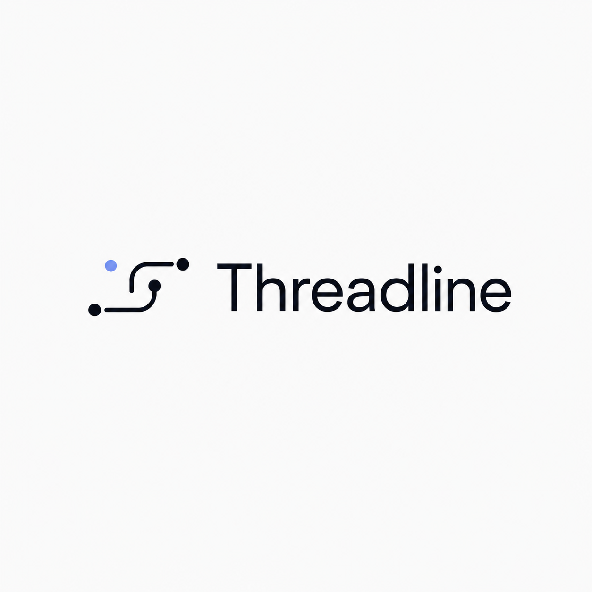
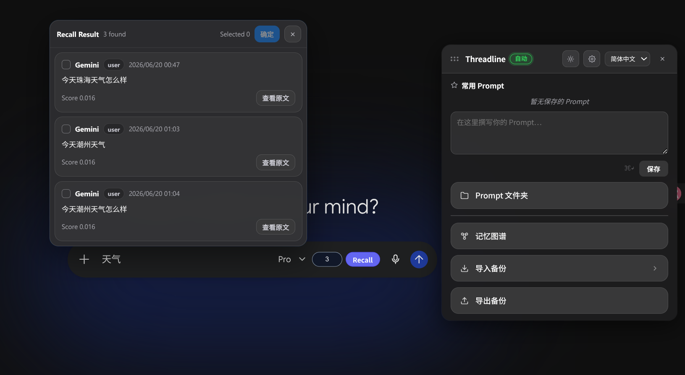
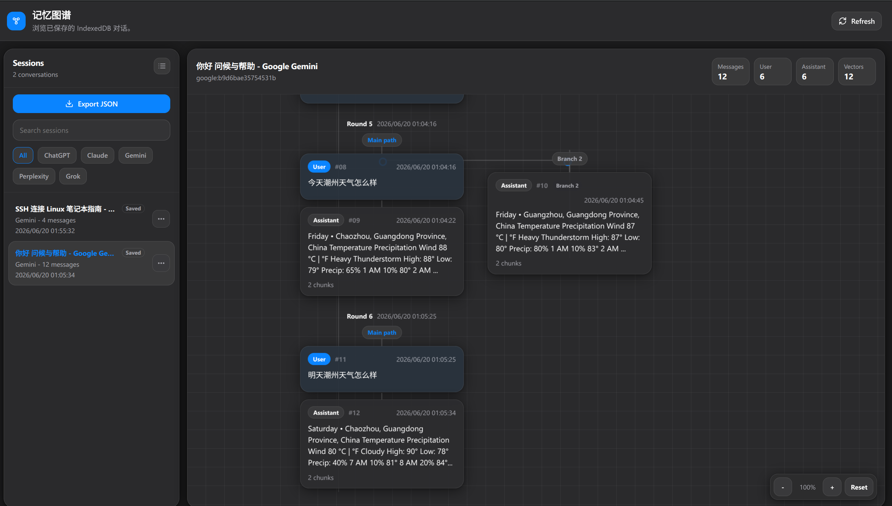

<div align="center">



# Threadline — AI 会話を保存してマップする

**AI チャット履歴をローカルで保存、検索、Recall、可視化するブラウザ拡張機能です。**

[Main README](../README.md) · [English](README.en.md) · [简体中文](README.zh-CN.md) · [繁體中文](README.zh-TW.md) · [한국어](README.ko.md) · [Español](README.es.md) · [Français](README.fr.md) · [Deutsch](README.de.md)

</div>

---

Threadline は対応 AI サイトの会話を取得し、ブラウザ内の IndexedDB に保存します。ローカル embedding を生成して Recall に使い、各会話を分岐対応の Memory Graph として表示します。

このプロジェクトは [marswangyang/personal-ai-memory](https://github.com/marswangyang/personal-ai-memory) をベースにしており、会話をグラフとして扱う方向性は [Vector-Mesh/VectorMesh](https://github.com/Vector-Mesh/VectorMesh) から着想を得ています。

## Product Preview

### Recall Result Panel

<p align="center">
  
</p>

Recall の結果は AI 入力欄の上に表示され、選択した原文だけを composer に注入したり、Memory Graph で元メッセージを開いたりできます。

### Branch-Aware Memory Graph

<p align="center">
  
</p>

Memory Graph では保存済み・pending の session、provider filter、session actions、message count、vector 状態、zoom control、分岐 path を確認できます。

## Highlights

| Feature | Description |
|---|---|
| Local capture | ChatGPT、Claude、Gemini、Perplexity、Grok の会話をローカルに保存します。 |
| Memory Graph | 保存済み session と pending session をフルタブで閲覧できます。 |
| Branch view | プロンプト編集や再試行を平坦な時系列ではなく分岐パスとして表示します。 |
| Auto / Manual save | Auto は即保存、Manual は確認してから IndexedDB に保存します。 |
| Recall Result panel | 入力欄の上に top-k memory を表示し、選択した原文だけを注入します。 |

## Installation

Requirements:

- Node.js 18+
- pnpm
- Chrome、Edge、Brave などの Chromium ブラウザ

```bash
git clone https://github.com/terra901/Threadline.git
cd Threadline
pnpm install
pnpm build
```

Load the extension:

1. `chrome://extensions/` を開きます。
2. **Developer mode** を有効にします。
3. **Load unpacked** をクリックします。
4. `build/chrome-mv3-prod` を選択します。

Development:

```bash
pnpm dev
```

Then load `build/chrome-mv3-dev`.

## Usage

1. 対応 AI サイトを開いて通常どおりチャットします。
2. Threadline のフローティングボタンをクリックしてパネルを開きます。
3. 設定で Auto または Manual save mode を選びます。
4. **Memory Graph** を開いて保存済み・pending の session を閲覧します。
5. AI 入力欄の横にある **Recall** で関連 memory を検索します。
6. Recall Result panel で結果を選び、**Confirm** で入力欄へ注入します。

## Data Storage

Threadline stores data in browser extension storage:

| Storage | Purpose |
|---|---|
| IndexedDB `AIMemoryDB` | 会話記録、metadata、embedding、soft-delete flags。 |
| `chrome.storage.local` | settings、language、theme、prompts、pending sessions。 |
| Offscreen document | ローカル embedding 推論を実行します。 |

`AIMemoryDB` は既存のローカルデータとの互換性のため意図的に保持しています。

## Privacy

Threadline has no server. Conversation content stays in your browser profile and is not uploaded to a Threadline service. Embeddings run locally through Transformers.js / ONNX; the model may be downloaded by the extension runtime if not cached.

## License

Apache License 2.0. See [LICENSE](../LICENSE).
